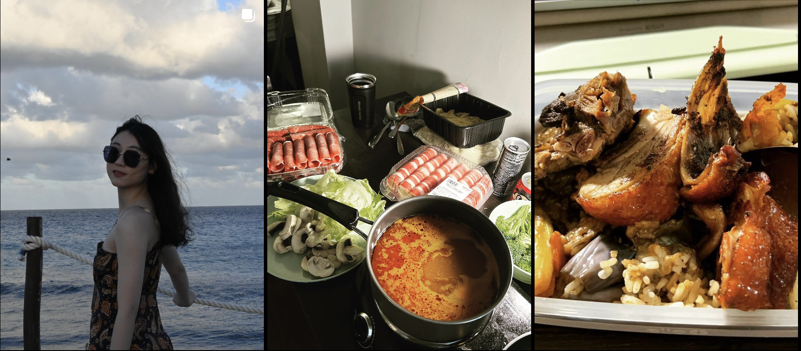

A skeleton profile page of Instagram. This has limited resizing capabilities and is built using HTML and CSS. To preview the application, install the Live Server extension in VS code and click "Go Live" in the bottom right corner

